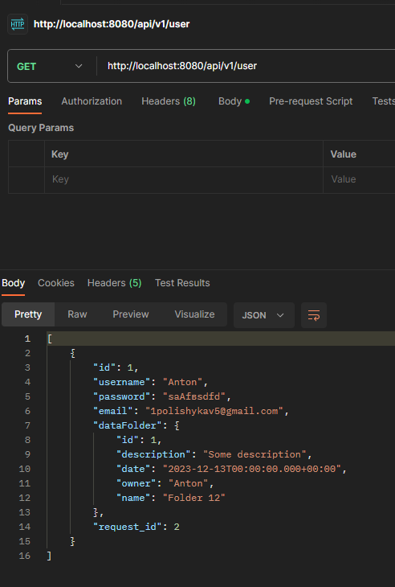
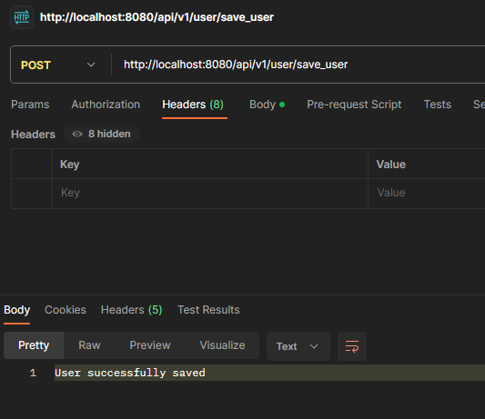
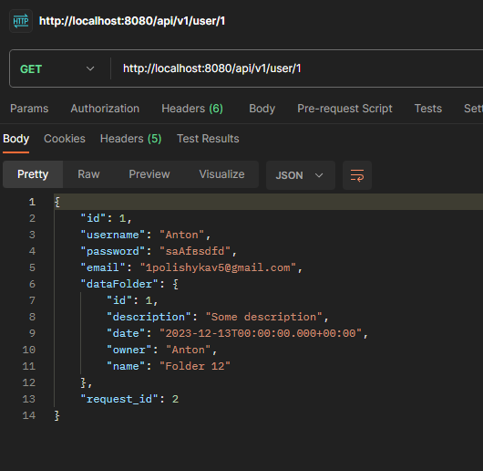
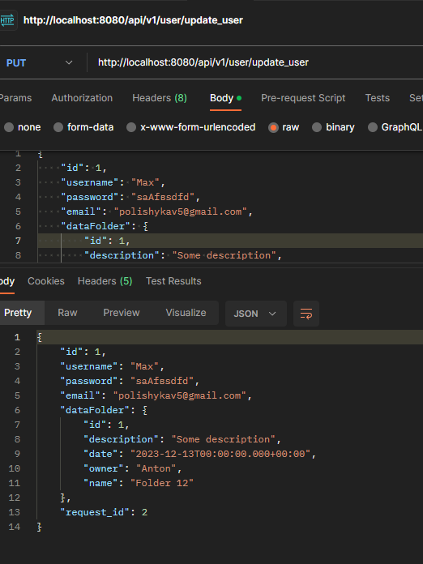
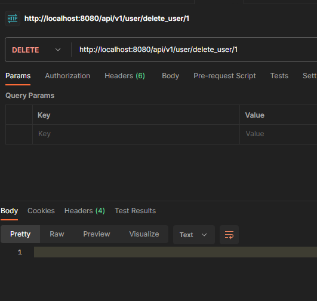
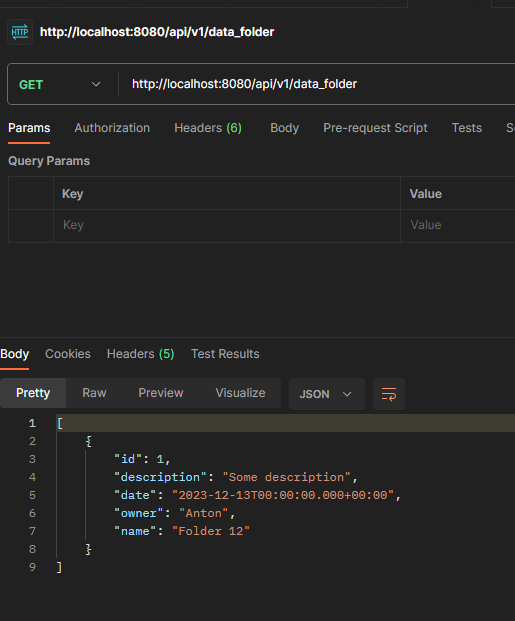
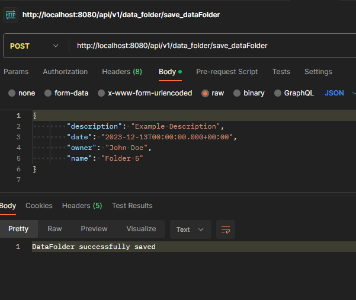
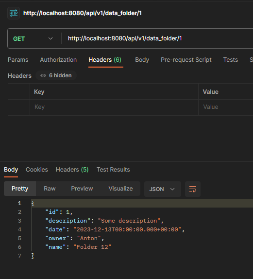
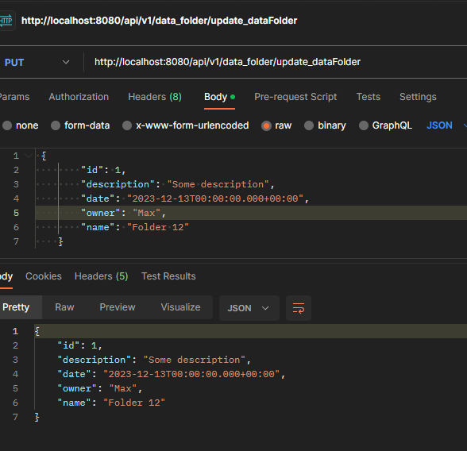
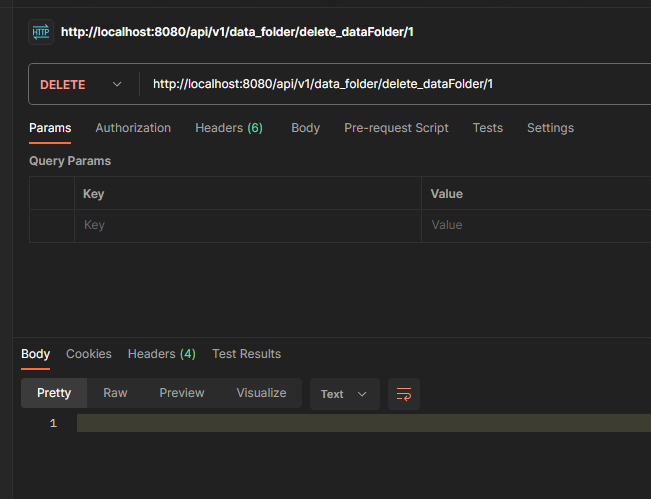

# Тестування працездатності системи

# Тестування працездатності системи

Для тестування системи використовувся Postman

## User

### Get (All)

    

### Post

    

### Get/Id

    

###  Put

    

###  Delete

    

## DataFolder

### Get (All)

    

### Post

    

### Get/Id

    

###  Put

    

###  Delete

    

